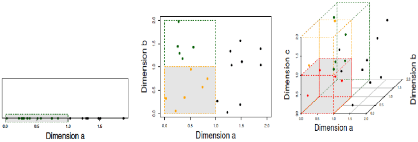

```{r initial_chunk, echo = FALSE, warning = FALSE, message = FALSE}
library("knitr")
opts_chunk$set(echo = TRUE, eval = TRUE, warning = FALSE, message = FALSE, cache = TRUE, fig.align = 'center', dpi = 300, out.width = '75%')
```

Les différentes librairies qui seront utilisés pour ce TP sont listées ici. Le code pour générer ce document ainsi que le code R qui a servi de base peuvent être trouvés [ici](https://github.com/MathieuMarauri/apprentissage-2020/blob/master/tp1/output/correction.Rmd) et [là](https://github.com/MathieuMarauri/apprentissage-2020/blob/master/tp1/src/TP1.R).

```{r librairies}
library("caret") # ensemble de meta-fonctions nécessaires au processus d'apprentissage supervisé
library("class") # fonction knn
library("e1071") # librairie nécessaire pour la fonction tune.knn
library("FactoMineR") # ACM
library("ggplot2") # data visualisation
library("klaR") # fonction Naivebayes utilisée avec la librairie caret
library("mlbench") # dataset Vehicle
```

```{r ggplot-theme, echo = FALSE}
library("kableExtra") # table formating
library("magrittr") # Pipe operators
# Set default ggplot theme
theme_set(
  theme_light(  
  base_size = 15
  ) +
  theme(
    text = element_text(family = "Gibson", colour = "gray10"),
    panel.border = element_blank(),
    axis.line = element_line(colour = "gray50", size = .5),
    axis.ticks = element_blank(),
    strip.background = element_rect(colour = "gray50", fill = "transparent", size = .7),
    strip.text.x = element_text(colour = "gray10"),
    strip.text.y = element_text(colour = "gray10"),
    legend.key.size = unit(1.5, "cm")
  )
)

# Set default scales
scale_colour_continuous <- function(...) ggplot2::scale_colour_viridis_c(..., option = "viridis")
scale_colour_discrete <- function(...) ggplot2::scale_colour_viridis_d(..., option = "viridis")
scale_fill_continuous <- function(...) ggplot2::scale_fill_viridis_c(..., option = "viridis")
scale_fill_discrete <- function(...) ggplot2::scale_fill_viridis_d(..., option = "viridis")
```


# Exercice 1 - Règle et risque de Bayes en discrimination binaire

Voici 3 problèmes de discrimination binaire, on a simulé un échantillon de taille $n = 1000$ pour les cas 1 et 2.

__Cas 1__

Pour $i = 1..1000$, $X_i \sim \mathcal{N}(0, 1)$, $U_i \sim \mathcal{U}[0, 1]$ on a :

$$
Y_i = \begin{cases}
      \mathbb{1}_{U_i \leq 0,1} & \text{si $X_i \leq 0$}\\
      \mathbb{1}_{U_i > 0,2} & \text{si $X_i > 0$}\\
    \end{cases}
$$
__Cas 2__

Pour $i = 1..1000$, $X_i \sim \mathcal{N}(0, 1)$, $U_i \sim \mathcal{U}[0, 1]$ on a :

$$
Y_i = \begin{cases}
      \mathbb{1}_{U_i \leq 0,2} & \text{si $X_i \leq 0$}\\
      \mathbb{1}_{U_i > 0,4} & \text{si $X_i > 0$}\\
    \end{cases}
$$

__Cas 3__

On travaille sur des données réelles issues d'une enquête, à partir d'un échantillon tiré au hasard de $n=1000$ consommateurs de café. La variable à expliquer $Y$ est qualitative binaire et prend les modalités "sucré" et "non sucré". La variable explicative à notre disposition est $X$ qui représente le sexe. On dispose de la table avec en lignes les 1000 consommateurs et en colonnes les 2 variables $X$ et $Y$. Des résultats de statistique bivariée nous donnent :

* Parmi les femmes, on a 20% qui prennent du sucre dans leur café $Y="sucré"$
* Parmi les hommes, on a 10% qui prennent du sucre dans leur café $Y="sucré"$

## Question 1 - Règle de Bayes

>_Donner dans chacun des trois cas, si c'est possible, la règle de Bayes et le risque de Bayes._

Dans le cas de la discrimination binaire la règle de Bayes est de la forme suivante : 

$$
\begin{align*}
  f^*(x) \colon \mathbb{R} &\to \{0, 1\}\\
  x &\mapsto f^*(x) = \begin{cases}
      1 & \text{si $P(Y=1|X=x) > 0,5$}\\
      0 & \text{sinon}\\
    \end{cases}
\end{align*}
$$

__Cas 1__

On définie la règle de Bayes en calculant $P(Y=1|X=x_i)$ selon les valeurs de $X$.

Pour $X \leq 0$ : $P(Y=1|X=x_i)=P(U_i \leq 0,1) = 0,1$ d'où $f^*(x_i) = 0$.

Pour $X > 0$ : $P(Y=1|X=x_i)=P(U_i > 0,2) = 1 - P(U_i \leq 0,2) = 0,8$ d'où $f^*(x_i) = 1$.

La règle de Bayes est donc : 

$$
f^*(x) = \begin{cases}
      1 & \text{si $x > 0$}\\
      0 & \text{sinon}\\
    \end{cases}
$$

On calcule maintenant l'erreur de Bayes. Elle correspond à la différence entre la prédiction obtenue avec la règle de Bayes, $f^*(X)$, et la vraie valeur, $Y$.

$$
\begin{split}
\mathcal{R}_P^* & = P(Y \neq f^*(X)) \\
& = P(Y = 1 \cap f^*(X) = 0) + P(Y = 0 \cap f^*(X) = 1) \\
& = P(Y = 1 \cap X \leq 0) + P(Y = 0 \cap X > 0) \\
& = P(X \leq 0) \times P(Y = 1 | X \leq 0) + P(X > 0) \times P(Y = 0 | X > 0) \\
& = 0,5 \times 0,1 + 0,5 \times 0,2 \\
& = 0,15
\end{split}
$$

__Cas 2__

On définie la règle de Bayes en calculant $P(Y=1|X=x_i)$ selon les valeurs de $X$.

Pour $X \leq 0$ : $P(Y=1|X=x_i)=P(U_i \leq 0,2) = 0,2$ d'où $f^*(x_i) = 0$.

Pour $X > 0$ : $P(Y=1|X=x_i)=P(U_i > 0,4) = 1 - P(U_i \leq 0,4) = 0,6$ d'où $f^*(x_i) = 1$.

La règle de Bayes est donc : 

$$
f^*(x) = \begin{cases}
      1 & \text{si $x > 0$}\\
      0 & \text{sinon}\\
    \end{cases}
$$

On calcule maintenant l'erreur de Bayes. Elle correspond à la différence entre la prédiction obtenue avec la règle de Bayes, $f^*(X)$, et la vraie valeur, $Y$.

$$
\begin{split}
\mathcal{R}^* & = P(Y \neq f^*(X)) \\
& = P(Y = 1 \cap f^*(X) = 0) + P(Y = 0 \cap f^*(X) = 1) \\
& = P(Y = 1 \cap X \leq 0) + P(Y = 0 \cap X > 0) \\
& = P(X \leq 0) \times P(Y = 1 | X \leq 0) + P(X > 0) \times P(Y = 0 | X > 0) \\
& = 0,5 \times 0,2 + 0,5 \times 0,4 \\
& = 0,3
\end{split}
$$

__Cas 3__

Comme la loi jointe de $(X, Y)$ n'est pas connue il est impossible de connaître la règle de Bayes et donc l'erreur de Bayes.

## Question 2 - Complexité

>_Est-il possible de donner un indicateur de la complexité de ces problèmes et ainsi de les ordonner en fonction de leur complexité ?_

Le risque de Bayes donne une idée de la complexité du problème. Plus l'erreur théorique minimale est importante plus on considère le problème comme complexe. Ainsi le cas 2 est plus complexe que le premier. 

## Question 3 - Simulation

>_Simuler les données du cas 2 et créer en plus un échantillon test de taille 200 (avec le même modèle)._

On va générer un vecteur de $X$ et un vecteur de $Y$ de longueur 1000. On fixe une graine pour que nos résultats soient reproductibles.

```{r simul_data}
# Nombre d'éléments dans l'échantillon
n_train <- 1000

# Générer X selon une loi normale
set.seed(1)
X <- rnorm(n_train)

# Générer U selon une loi uniforme
set.seed(2)
U <- runif(n_train)

# Générer le vecteur réponse Y selon le cas 2
Y1 <- rep(0, n_train)
Y1[X <= 0 & U <= 0.2] <- 1
Y1[X > 0 & U > 0.4] <- 1

# Y est transformé en factor pour faciliter l'utilisation de la fonction tune.knn dans la suite
Y <- as.factor(Y1)

# Créer un data.frame avec X et Y
data <- data.frame(X, Y)
```

Sur le graphe suivant on peut voir la densité de $X$ selon la valeur prise par $Y$.

```{r simul_plot}
ggplot(
  data = data,
  mapping = aes(x = X, fill = Y)
) +
  geom_density(
    alpha = .7
  ) +
  labs(
    x = "X",
    y = "Densité",
    title = "Données d'apprentissage",
    fill = "Y"
  )
```

De la même manière on peut simuler des données de test qui seront utilisées pour mesurer l'erreur de nos modèles de prédictions.

```{r simul_data_test}
n_test <- 200
set.seed(3)
X <- rnorm(n_test)
set.seed(4)
U <- runif(n_test)
Y2 <- rep(0, n_test)
Y2[X <= 0 & U <= 0.2] <- 1
Y2[X > 0 & U > 0.4] <- 1
Y <- as.factor(Y2)
test <- data.frame(X, Y)
ggplot(
  data = test,
  mapping = aes(x = X, fill = Y)
) +
  geom_density(
    alpha = .7
  ) +
  labs(
    x = "X",
    y = "Densité",
    title = "Données de test",
    fill = "Y"
  )
```

## Question 4 - Knn

>_Quelle est la règle de décision associée à l'algorithme des k plus proches voisins ? Mettre en oeuvre les k plus proches voisins. Justifier le choix des paramètres et commenter les résultats en validation et sur l'échantillon test._

#### Le modèle KNN

Le modèle des $K$ plus-proches-voisins (_K-nearest-neighbours_ en anglais) est un modèle d'apprentissage supervisé utilisable en classification et en régression. Son principe est simple. Pour prédire la classe d'une nouvelle observation, on calcule la distance qui sépare ce nouveau point de tous les points des données d'apprentissage, on sélectionne les $k$ points les plus proches puis on détermine la classe à prédire en faisant un vote à la majorité. 

<div style="text-align:center">

</div>

_Quelques points d'attention :_

* L'hyper-paramètre $k$ est bien sûr l'élément central de ce modèle. Il faut choisir sa valeur de manière réfléchie (on verra dans la suite comment procéder). 
* La distance utilisée est aussi un point important. On choisira souvent la distance euclidienne mais il est bon de savoir qu'on peut utiliser n'importe quelle mesure de similarité selon les besoins. 
* Enfin il faut savoir que plus il y a de prédicteurs plus les plus proches voisins seront potentiellement éloignés, c'est ce que l'on appelle le fléau de la dimension. 

<div style="text-align:center">

</div>

#### La règle de décision

Dans le cas d'une classification, la règle de décision associée aux $k$ plus-proches-voisins est le vote à la majorité. Pour $k=5$ par exemple, si 3 voisins ont $Y=0$ et 2 voisins ont $Y=1$ alors la prédiction sera $\widehat{Y}=0$.

#### Un premier modèle

On commence par lancer un modèle de k plus-proches-voisins avec un choix arbitraire pour $k$, 10 par exemple. Pour des questions de reproductibilité on fixe là aussi une graîne. On utilise la fonction `class::knn()` qui prend 4 paramètres en entrée : 

* `train` : les prédicteurs des données d'apprentissage,
* `test` : les prédicteurs des données de tests sur lesquelles se feront les prédictions,
* `cl` : le vecteur de la variable cible des données d'apprentissage,
* `k` : le nombre de plus-proches-voisins souhaité.

```{r knn}
set.seed(123456)
knn_pred <- knn(
  train = as.matrix(data$X), # données d'apprentissage
  test = as.matrix(test$X), # données à prédire
  cl = data$Y, # vraies valeurs
  k = 10 # nombre de voisins
)
```

On peut calculer l'erreur et la précision de ce modèle. 

```{r knn_perf, eval = FALSE}
# Taux de bonnes prédictions
sum(knn_pred == test$Y) / n_test

# Taux d'erreur
1 - sum(knn_pred == test$Y) / n_test
```

L'erreur est de `r 1 - sum(knn_pred == test$Y) / n_test`. 

#### Le choix de $k$

La valeur de $k$ a été définie de façon arbitraire, on peut optimiser ce choix en essayant différentes valeurs et en choisissant la meilleure. Cela se fait en découpant l'échantillon d'apprentissage en une partie apprentissage et une partie validation. La règle de décision est construite sur la partie apprentissage et les prédictions sont faites sur la partie validation. On peut ainsi mesurer une erreur sur des données qui n'ont pas servi à construire la règle de décision, les données de validation. Pour cela on utilise la fonction `e1071::tune.knn()` qui prend 4 paramètres en entrée : 

* `x` : les prédicteurs
* `y` : le vecteur cible
* `k` : un vecteur de valeurs de $k$ à tester
* `tunecontrol` : la méthode d'échantillonnage, sous la forme d'une fonction `tune.control(sampling = "cross")` pour de la validation croisée (dans ce cas il faut également spécifier l'argument `cross = 5` pour faire de la 5-fold cv) ou `tune.control(sampling = "boot")` pour faire du bootstrap.

```{r knn_tune}
knn_cross_results <- tune.knn(
  x = data$X, # predicteurs
  y = data$Y, # réponse
  k = 1:50, # essayer knn avec K variant de 1 à 50
  tunecontrol = tune.control(sampling = "cross"), # utilisation de la cross validation
  cross = 5 # 5 blocs
)
```

On peut visualiser les erreurs obtenues sur le graphique suivant.

```{r knn_tune_plot}
ggplot(
  data = knn_cross_results$performances,
  mapping = aes(x = k, y = error)
) + 
  geom_line() +
  geom_point() + 
  labs(
    x = "k",
    y = "Erreur de validation",
    title = "Evolution de l'erreur selon k"
  )
```

Le meilleur $k$ est obtenu avec la commande `knn_cross_results$best.parameters$k` : `r knn_cross_results$best.parameters$k`. De cette manière le choix de $k$ n'est plus arbitraire mais basé sur nos données et le $k$ donnant l'erreur minimale (sur les données de validation) est choisi. 

_Remarque : la valeur optimale de $k$ peut varier à chaque fois que la commande est lancée. On verra dans l'exercice suivant comment on peut contourner ce problème._

On peut relancer la prédiction avec le $k$ sélectionné et calculer le taux d'erreur comme précédemment. 

```{r knn_opt}
set.seed(123456)
knn_pred <- knn(
  train = as.matrix(data$X), # données d'apprentissage
  test = as.matrix(test$X), # données à prédire
  cl = data$Y, # vraies valeurs
  k = knn_cross_results$best.parameters$k # nombre de voisins
)
```

L'erreur est de `r 1 - sum(knn_pred == test$Y) / n_test`. 

#### Analyse de l'erreur

L'erreur obtenue est très proche de l'erreur de Bayes calculée à la question 1. (Pour $k=30$, avec les mêmes graines, l'erreur est inférieure au risque de Bayes). Cela est due au fait que les données générées ne correspondent pas parfaitement à la loi définie dans l'énoncé du fait du faible nombre d'observations simulées (200). On peut simuler un nombre supérieur de données, 2000 par exemple, et recalculer l'erreur. Pour ce faire on procède comme précédemment. 

```{r knn_2000}
n_test2 <- 2000
set.seed(3)
X <- rnorm(n_test2)
set.seed(4)
U <- runif(n_test2)
Y2 <- rep(0, n_test2)
Y2[X <= 0 & U <= 0.2] <- 1
Y2[X > 0 & U > 0.4] <- 1
Y <- as.factor(Y2)
test2 <- data.frame(X, Y)
set.seed(123456)
knn_pred2 <- knn(
  train = as.matrix(data$X), # données d'apprentissage
  test = as.matrix(test2$X), # données à prédire
  cl = data$Y, # vraies valeurs
  k = knn_cross_results$best.parameters$k # nombre de voisins
)
```

L'erreur est maintenant de `r 1 - sum(knn_pred2 == test2$Y) / n_test2`. Elle est bien supérieure à l'erreur minimale théorique. 

## Question 5 - Naive Bayes

>_Quelle est la règle de décision associée au bayésien naïf ? Mettre en oeuvre le Bayésien naïf. Justifier le choix des paramètres et commenter les résultats en validation et sur l'échantillon test._

#### Le modèle bayésien naïf

Ce modèle se base sur la formule de Bayes : 

$$
P(Y=y|X=x) = \frac{P(Y=y) \times P(X=x|Y=y)}{P(X=x)}
$$
Pour estimer $P(Y=y|X=x)$ (le but de tout modèle d'apprentissage supervisé) il faut donc estimer $P(Y=y)$, $P(X=x|Y=y)$ et $P(X=x)$. Précisément on cherche quelle classe prédire, c'est à dire le $y$ qui correspondra à la plus grande probabilité. 

On cherche donc :

$$
\underset{y \in \mathcal{Y}}{\arg\max} \ \ \widehat{P}(Y=y|X=x)
$$

Comme $P(X=x)$ ne dépend pas de $y$ on cherche donc :

$$
\underset{y \in \mathcal{Y}}{\arg\max} \ \ \widehat{P}(Y=y) \times \widehat{P}(X=x|Y=y)
$$

Le calcul de $\widehat{P}(Y=y)$ se fait directement par les fréquences empiriques. $\widehat{P}(X=x|Y=y)$ se calcule en faisant l'hypothèse que tous les $X_j$, les différentes variables explicatives, sont indépendants conditionnellement à $Y$. On a donc :

$$
\widehat{P}(X=x|Y=y) = \prod_{j=1}^{J}\widehat{P}(X_j=x_j|Y=y)
$$

On calcule donc : 

$$
\underset{y \in \mathcal{Y}}{\arg\max} \ \ \widehat{P}(Y=y) \times \prod_{j=1}^{J}\widehat{P}(X_j=x_j|Y=y)
$$

#### La règle de décision

Avec le modèle bayésien naïf on calcule $\widehat{P}(Y=y|X=x)$ pour $y=0, 1$. Pour choisir la classe $Y$ on va prendre la probabilité la plus forte, c'est à dire celle qui est supérieur à $0,5$.

#### Un premier modèle

La fonction utilisée pour réaliser un modèle bayésien naïf est la fonction `klaR::NaiveBayes()`. Elle prend 2 paramètres en entrée : 

* `formula` : une formule spécifiant le modèle, ici ce sera simplement `Y ~ X`,
* `data` : un data.frame contenant les variables utilisées dans l'argument `formula`

```{r nb}
naive_bayes_model <- NaiveBayes(
  formula = Y ~ X, 
  data = data
)
```

On peut utiliser ce modèle pour effectuer des prédictions sur le jeu de données de test et ainsi mesurer l'erreur sur des données non utilisées pour apprendre les probabilités $\widehat{P}(Y=y|X=x)$.

```{r nb_pred}
naive_bayes_pred <- predict(
  object = naive_bayes_model, 
  newdata = test
)
```

Comme précédemment on peut mesurer la précision du modèle ainsi que son erreur de la façon suivante.

```{r nb_pred_perf, eval = FALSE}
# Taux de bonnes prédictions
sum(naive_bayes_pred$class == test$Y) / n_test

# Taux d'erreur
1 - sum(naive_bayes_pred$class == test$Y) / n_test
```

Le taux d'erreur est de `r 1 - sum(naive_bayes_pred$class == test$Y) / n_test`.

#### Le choix des paramètres

Le modèle bayésien naïf a été lancé avec ses paramètres par défaut. 3 hyper-paramètres peuvent être modifiés : 

* l'utilisation ou non d'un noyau pour estimer les densités des variables numériques, `usekernel`
* la largeur de bande utilisée par le noyau (ou plus précisément un facteur multiplicatif qui sera appliqué à une largeur de bande pré-définie), `adjust`
* la correction de Laplace à appliquer pour les variables catégorielles, `fL`.

Pour choisir la meilleure combinaison d'hyper-paramètres pour le modèle bayésien naïf, on va diviser notre jeu de données, `data`, en 2 groupes : apprentissage et validation. Comme pour le choix de $k$ dans le modèle des $k$ plus-proches-voisins, le but est d'estimer l'erreur sur les données de validation pour chaque combinaison d'hyper-paramètres et de sélectionner la combinaison avec l'erreur la plus faible. 

On commence par spécifier l'ensemble des combinaisons d'hyper-paramètres que l'on souhaite évaluer. Parmi les 3 hyper-paramètres nécessaires seuls 2 seront utilisés dans notre cas : `usekernel` et `adjust`. En effet la correction de Laplace sert pour les variables catégorielles or notre jeu de données ne comporte que des données numériques. 

```{r nb_param_grid}
hyperparam_grid <- expand.grid(
  usekernel = TRUE, # si vrai utilisation d'un noyau sinon gaussien
  fL = 0, # correction avec lissage de Laplace (ici ce paramètre n'est pas nécessaire, x étant continue)
  adjust = seq(1, 5, by = 1) # largeur de bande
)
hyperparam_grid <- rbind(hyperparam_grid, data.frame(usekernel = FALSE, fL = 0, adjust = 1))
```

On construit ensuite la séparation entre données d'apprentissage et de validation.

```{r nb_split}
set.seed(123456)
train_index <- sample(1:nrow(data), size = nrow(data) * .8)
validation_index <- setdiff(1:nrow(data), train_index)
train <- data[train_index, ]
validation <- data[validation_index, ]
```

On va maintenant entraîner autant de modèles qu'il y a de combinaisons et calculer l'erreur sur les données de validation pour chacun de ces modèles.

```{r nb_train}
results <- cbind(hyperparam_grid, "error" = 0)
for (i in 1:nrow(results)) {
  naive_bayes_model <- NaiveBayes(
    formula = Y ~ X,
    data = train,
    usekernel = results$usekernel[i],
    fL = results$fL[i],
    adjust = results$adjust[i]
  )
  naive_bayes_pred <- predict(
    object = naive_bayes_model,
    newdata = validation
  )
  results[i, "error"] <- 1 - sum(naive_bayes_pred$class == validation$Y) / length(validation_index)
}
```

On peut visualiser les résultat sous forme graphique pour choisir la combinaison d'hyper-paramètres donnant le meilleur résultat.

```{r nb_train_plot}
ggplot(
  data = results,
  mapping = aes(x = adjust, y = error, color = usekernel)
) +
  geom_line() +
  geom_point() +
  labs(
    x = "Largeur de bande",
    y = "Erreur",
    title = "Comparaison des hyper-paramètres",
    color = "Utilisation d'un noyau ?"
  ) +
  theme(
    legend.position = c(.8, .22)
  )
```

Le meilleur modèle est obtenu avec l'utilisation d'un noyau pour estimer la densité et une largeur de bande de 1 (plus précisément un facteur multiplicatif de la largeur de bande de 1).

On va donc utiliser ces hyper-paramètres pour effectuer une prédiction sur les données de test et ainsi mesurer l'erreur de généralisation du modèle bayésien naïf. Pour ce faire on va entraîner le modèle avec les hyper-paramètres sélectionnés sur l'ensemble des données train + validation puis effectuer une prédiction sur les données de test.

```{r nb_predict}
naive_bayes_model <- NaiveBayes(
  formula = Y ~ X,
  data = data,
  usekernel = TRUE,
  fL = 0,
  adjust = 1
)
naive_bayes_pred <- predict(
  object = naive_bayes_model,
  newdata = test
)
```

Comme précédemment on calcule l'erreur de généralisation. On obtient `r 1 - sum(naive_bayes_pred$class == test$Y) / n_test`.

```{r nb_error, eval = FALSE}
sum(naive_bayes_pred$class == test$Y) / n_test
1 - sum(naive_bayes_pred$class == test$Y) / n_test
```

#### Analyse de l'erreur

On remarque que l'erreur de validation et l'erreur de test sont légèrement différentes. Les données sur lesquelles l'estimation de l'erreur a été faite sont différentes : les données de validation, sur lesquelles on a choisi les meilleurs hyper-paramètres, et les données de test.

# Exercice 2 - Discrimination à plusieurs classes

On utilisera les K plus proches voisins et Bayésien naïf pour discriminer les 4 types de véhicules (variable à expliquer à 4 modalités) à l'aide de différentes variables décrivant la silhouette d'un véhicule.

## Question 1 - Import des données

>_Charger la table Vehicle après avoir chargé le package `mlbench`. Lire la description de la table. Combien de prédicteurs potentiels dans cette table ?_

On commence par charger la table `Vehicule` avec la commande `data(Vehicle)` et par avoir un aperçu des données contenues dedans. On peut regarder directement les données en affichant le data.frame, visualiser un résumé avec `summary()` ou encore utiliser `skimr::skim()`.

```{r vehicule, echo = FALSE}
data(Vehicle)
```

La variable cible est `class`, elle comporte 4 modalités. Les 18 autres variables sont toutes quantitatives et peuvent toutes être utilisées comme prédicteurs. 

```{r predicteurs}
predicteurs <- names(Vehicle)[-19]
```

_Points d'attention_

Le modèle des k-plus-proches-voisins est sensible au nombre de prédicteurs or ici il y en 18. Une pré-sélection de variables pourrait être la bienvenue. 

Toutes les variables explicatives ne sont pas sur la même échelle de valeurs. Il faudra harmoniser les échelles pour que le calcul de distance ne soit pas impacté.

## Question 2 - Fonction de coût

>_Quelle fonction de coût utiliser ?_

Dans le cas d'une classification, la fonction de coût est l'erreur du modèle. Pour $n$ observations de test on a donc :

$$
\mathscr{L}(y, \widehat{y}) = \mathbb{1}_{y \neq \widehat{y}}
$$

Pour calculer cette erreur on va séparer les données en un ensemble d'apprentissage et un ensemble de test. On définit une graine pour pouvoir reproduire les résultats et on choisit un ratio 80/20. 

```{r split}
set.seed(123456)
train_index <- sample(1:nrow(Vehicle), size = nrow(Vehicle) * .8)
test_index <- setdiff(1:nrow(Vehicle), train_index)
train <- Vehicle[train_index, ]
test <- Vehicle[test_index, ]
```

## Question 3 - Knn

>_Quelle est la règle de décision associée à l'algorithme des k plus proches voisins ? Mettre en oeuvre les k plus proches voisins. Justifir le choix des paramètres et commenter les résultats._

Comme dans le cas précédent on va utiliser le vote à la majorité pour choisir la classe. Le choix de la meilleure valeur de $k$ se fait par validation croisée avec la fonction `e1071::tune.knn()`. On a vu que la valeur retournée pouvait varier. On va ici lancer plusieurs fois cette fonction pour ensuite choisir la valeur de $k$ la plus fréquemment retournée. 

Les données doivent être mise sur la même échelle pour éviter d'introduire artificiellement de l'importance sur certaines variables. Ce traitement doit être effectué sur les données de train et sur les données de test. Pour les données de test il faut appliquer les mêmes paramètres que pour les données de train.

```{r knn_scale}
train_scaled <- scale(train[, predicteurs])
test_scaled <- scale(
  x = test[, predicteurs], 
  center = attributes(train_scaled)[["scaled:center"]],
  scale = attributes(train_scaled)[["scaled:scale"]]
)
```

On entraîne le modèle sur ces données.

```{r tune_knn_loop}
best_k <- numeric(length = 20)
for (i in 1:20) {
  knn_cross_results <- tune.knn(
    x = train_scaled,
    y = train$Class,
    k = 1:50,
    tunecontrol = tune.control(sampling = "cross"),
    cross = 5
  )
  best_k[i] <- knn_cross_results$best.parameters[[1]]
  # print(sprintf("Itération %s : meilleur K = %s", i, knn_cross_results$best.parameters))
}
```


```{r tune_knn_loop_table, echo = FALSE}
table <- t(as.data.frame(table(best_k)))
rownames(table) <- c("Valeur de K", "Nombre d'occurences")
kable(
  x = table,
  align = c('c', 'r'), 
  col.names = NA
) %>% 
  kable_styling(full_width = FALSE)
```

On utilise la valeur la plus fréquente pour construire notre modèle de plus-proches-voisins et ainsi mesurer l'erreur sur l'échantillon de test. Le modèle est entraîné sur l'ensemble des données de la table `train`. 

```{r vehicule_knn}
set.seed(123456)
knn_pred <- knn(
  train = train_scaled, # données d'apprentissage
  test = test_scaled, # données à prédire
  cl = train$Class, # vraies valeurs
  k = 3 # nombre de voisins
)
```

L'erreur obtenue est `r  round(1 - sum(knn_pred == test[, "Class"]) / length(test_index), digits = 3)`.

## Question 4 - Naive Bayes

>_Quelle est la règle de décision associée au bayésien naïf ? Mettre en oeuvre le Bayésien naïf. Justifier le choix des paramètres et commenter les résultats._

#### La règle de décision

Comme dans le cas binaire pour l'exercice 1 c'est le maximum a posteriori qui est utilisé pour choisir la classe prédite.

#### Le choix des hyper-paramètres

On va ici utiliser la libraire `caret` qui comporte un ensemble de fonction facilitant la création de pipelines d'entraînement en apprentissage supervisé. [Ce livre en ligne](https://topepo.github.io/caret/) et [cette vignette d'introduction](https://cran.r-project.org/web/packages/caret/vignettes/caret.html) donnent une bonne vision du fonctionnement de ce package. On va faire la même chose que dans l'exercice précédent, à savoir évaluer l'erreur de validation pour différentes combinaisons d'hyper-paramètres mais de manière simplifiée. 

On définit l'ensemble des combinaisons à tester. 

```{r vehicule_nb_param_grid}
hyperparam_grid <- expand.grid(
  usekernel = TRUE, # si vrai utilisation d'un noyau sinon gaussien
  fL = 0, # correction avec lissage de Laplace (ici ce paramètre n'est pas nécessaire, x étant continue)
  adjust = seq(1, 5, by = 1) # largeur de bande
)
hyperparam_grid <- rbind(hyperparam_grid, data.frame(usekernel = FALSE, fL = 0, adjust = 1))
```

On va définir la façon de séparer les données en apprentissage et validation avec la fonction `caret::trainControl()`. On spécifie l'argument `method` à `"cv"` pour faire de la validation croisée et l'argument `number` à `5` pour utiliser 5 blocs.

```{r vehicule_nb_control}
control <- trainControl(method = "cv", number = 5)
```

On peut ensuite entraîner le modèle avec la fonction `caret::train()`. Un modèle par combinaison sera entraîné et l'erreur sera calculée sur l'échantillon de validation. La fonction `caret::train()` prend 5 arguments : 

* `x` : les prédicteurs
* `y` : le vecteur de la variable cible
* `method` : le nom du modèle à entraîner, ici `"nb"` pour Naive Bayes
* `trControl` : la méthode de validation
* `tunegrid` : la grille d'hyper-paramètres à tester

Cette fonction va choisir les meilleurs hyper-paramètres et retourner le meilleur modèle directement. 

```{r vehicule_nb_train}
naive_bayes <- train(
  x = train[, predicteurs], # prédicteurs
  y = train$Class, # réponse
  method = "nb", # classifieur utilisé, ici Naive Bayes
  trControl = control, # méthode d'échantillonnage, ici 5-fold CV
  tuneGrid = hyperparam_grid # combinaisons d'hyper-paramètres à évaluer
) 
```

On peut visualiser les résultats sous forme graphique. On trace ici la précision. 

```{r vehicule_nb_train_plot}
ggplot(
  data = naive_bayes$results,
  mapping = aes(x = adjust, y = Accuracy, color = usekernel)
) + 
  geom_line() + 
  geom_point() + 
  labs(
    x = "Largeur de bande",
    y = "Précision",
    title = "Comparaison des hyper-paramètres",
    color = "Utilisation d'un noyau ?"
  ) + 
  theme(
    legend.position = c(.8, .8)
  )
```

Le meilleur modèle est obtenu avec l'utilisation d'une estimation par noyau et une largeur de bande de 1.

La fonction `caret::predict()` va utiliser directement le résultat de la fonction `caret::train()` et donc les meilleurs hyper-paramètres pour effectuer la prédiction.

```{r vehicule_nb_predict}
naive_bayes_pred <- predict(
  object = naive_bayes, 
  newdata = test
)
```

L'erreur de généralisation est de `r round(1 - sum(naive_bayes_pred == test$"Class") / length(test_index), digits = 3)`. 

#### Pourquoi des _warnings_ ?

On peut remarquer que la fonction `predict()` génère des messages de _warning_ de la forme : `Numerical 0 probability for all classes with observation`. Cela veut dire que les 4 probabilités initialement calculées par le modèle sont toutes très faibles. Il s'agit des $P(Y = y) \times P(X = x|Y=y)$. Leur comparaison n'est donc peut-être pas pertinente. La fonction renvoie ces probabilités normalisées donc ces faibles valeurs n'apparaissent pas lorsqu'on regarde les résultats du modèle (utiliser la commande `predict(naive_bayes, test, type = "prob")` pour avoir les probabilités et non pas les classes directement).


# Exercice 3 - Problème de régression

__Context__: Since 2008, guests and hosts have used Airbnb to expand on traveling possibilities and present more unique, personalized way of experiencing the world. This dataset describes the listing activity and metrics in NYC, NY for 2019.

__Content__: This data file includes all needed information to nd out more about hosts, geographical availability, necessary metrics to make predictions and draw conclusions.

__Acknowledgements__ This public dataset is part of Airbnb, and the original source can be found on this website.

__Source__: kaggle and Airbnb.

* id : listing ID
* name : name of the listing
* host id : host ID
* host name : name of the host
* neighbourhood group : location
* neighbourhood : area
* latitude : latitude coordinates
* longitude : longitude coordinates
* room type listing : space type
* price : price in dollars
* minimum nights : amount of nights minimum
* number of reviews : number of reviews
* last review : latest review
* reviews per month : number of reviews per month
* calculated host listings count : amount of listing per host
* availability 365 : number of days when listing is available for booking

La variable à expliquer est _price_.

## Question 1 - Choix des variables

>_Quelles variables explicatives proposez-vous d'utiliser si vous êtes un particulier et que vous souhaitez prédire à quel prix vous pourriez proposer votre logement en Airbnb en vous positionnant "au prix du marché"._

On commence par importer les données. 

```{r airbnb_import, eval = FALSE}
airbnb <- read.csv(file = "data/AB_NYC_2019.csv")
```

```{r airbnb_import2, echo = FALSE}
airbnb <- read.csv(file = "../data/AB_NYC_2019.csv")
```

Ici les seuls régresseurs utilisables pour un particulier qui n’est pas encore inscrit sur
Airbnb sont les variables de localisation (peut-être une sélection parmi les 4), et le type
de logement (room_type). La variable à prédire est, cette fois, une variable quantitative
(price).

## Question 2 - Fonction de coût

>_Quelle fonction de coût utiliser ?_

On est ici dans le cas d'une régression (variable cible quantitative), c'est donc la perte quadratique qui sera utilisée : 

$$
\mathscr{L}(Y, \widehat{Y}) = \|Y-\widehat{Y}\|^2
$$
Il s'agit simplement de la racine carrée de la moyenne des erreurs au carré. Pour estimer cette erreur on va diviser les données en un ensemble d'apprentissage et un ensemble de test. 

```{r airbnb_split}
set.seed(123456)
train_index <- sample(1:nrow(airbnb), size = nrow(airbnb) * .7)
test_index <- setdiff(1:nrow(airbnb), train_index)
train <- airbnb[train_index, ]
test <- airbnb[test_index, ]
```


## Question 3 - Knn

>_Quelle est la règle de décision associée à l'algorithme des k plus proches voisins ? Mettre en œuvre les k plus proches voisins. Justifier le choix des paramètres et commenter les résultats._

Parmi les variables explicatives à notre disposition on a : 

* `neighbourhood_group` : catégorielle à 5 modalités
* `neighbourhood` : catégorielle à 221 modalités
* `latitude` : numérique
* `longitude` : numérique
* `room_type` : catégorielle à 3 modalités

Il y a donc à la fois des variables continues et des variables catégorielles. On ne peut pas intégrer directement ces données dans l'algorithme KNN. En effet la distance utilisée par défaut est la distance euclidienne, or celle-ci s'applique uniquement aux données continues. 

Plusieurs solutions sont possibles : 

* Effectuer une ACM pour transformer les variables catégorielles en variables continues
* Utiliser la distance de Hamming qui est applicable pour tout type de données (ou tout autre distance avec les mêmes propriétés)
* Encoder les variables catégorielles en variables numériques
* Utiliser uniquement les variables continues

#### Variables continues uniquement

On va construire le modèle de k plus-proches-voisins en se basant uniquement sur les variables `latitude`et `longitude`. Comme précédemment on va tester différentes valeurs de $k$ pour choisir la meilleure valeur. Le choix de la plage de valeurs à tester peut se faire de manière itérative. On commence par un ensemble de valeurs larges puis on peut réduire petit à petit. 

```{r airbnb_knn_num_hyper}
knn_fit <- train(
  x = train[, c("latitude", "longitude")], # prédicteurs
  y = train[, "price"], # réponse
  tuneGrid = data.frame(k = seq(50, 500, by = 10)), # nombre de voisins
  method = "knn", # knn classifieur
  trControl = trainControl(method = "cv", number = 5) # 5-fold CV
)
```

On peut voir les résultats sur le graphique suivant.

```{r airbnb_knn_num_plot}
ggplot(
  data = knn_fit$results,
  mapping = aes(x = k, y = RMSE)
) +
  geom_line() +
  geom_point() +
  labs(
    x = "Valeurs de k",
    y = "Erreur quadratique",
    title = "Evaluation de l'erreur sur données de validation"
  )
```

On utilise ensuite les données de test pour calculer l'erreur de généralisation. 

```{r airbnb_knn_num_pred}
knn_pred <- predict(
  object = knn_fit,
  newdata = test
)
knn_num_error <- sqrt(mean((knn_pred - test$price)^2))
```

L'erreur est de `r round(sqrt(mean((knn_pred - test$price)^2)), digits = 3)`.

#### Variables catégorielles encodées

Les 3 variables catégorielles vont être encodées en variables continues. Les modalités sont transformées en nombre. De cette manière on pourra utiliser directement le modèle knn. Il faut faire attention à la manière avec laquelle on effectue cette transformation. En effet l'ensemble de test ne contient pas nécessairement les mêmes modalités que l'ensemble de train (cela sera surtout vrai pour les variables à forte cardinalité). 

```{r airbnb_knn_transform}
# Sur les données de train
train$room_type <- as.numeric(
  factor(
    x = train$room_type,
    levels = unique(airbnb$room_type)
  )
)
train$neighbourhood_group <- as.numeric(
  factor(
    x = train$neighbourhood_group,
    levels = unique(airbnb$neighbourhood_group)
  )
)
train$neighbourhood <- as.numeric(
  factor(
    x = train$neighbourhood,
    levels = unique(airbnb$neighbourhood)
  )
)

# Sur les données de test
test$room_type <- as.numeric(
  factor(
    x = test$room_type,
    levels = unique(airbnb$room_type)
  )
)
test$neighbourhood_group <- as.numeric(
  factor(
    x = test$neighbourhood_group,
    levels = unique(airbnb$neighbourhood_group)
  )
)
test$neighbourhood <- as.numeric(
  factor(
    x = test$neighbourhood,
    levels = unique(airbnb$neighbourhood)
  )
)
```

Chaque variable est transformée en factor en utilisant tous les niveaux présents dans la table initiale.

On peut ensuite, comme précédemment, construire le modèle et évaluer sa performance sur les données test. On pense bien sur à mettre nos variables sur la même échelle avec la fonction `scale()`. On n'oublie pas de sauvegarder les paramètres de cette transformation pour appliquer les mêmes au jeu de données de test. 

On va centrer et réduire les variables pour qu'elles soient sur la même échelle directement avec `caret`. 

```{r airbnb_knn_transform_model}
knn_fit <- train(
  x = train[, c("latitude", "longitude", "room_type", "neighbourhood_group", "neighbourhood")], # prédicteurs
  y = train$price, # réponse
  preProc = c("scale", "center"), # centrer et réduire
  tuneGrid = data.frame(k = seq(30, 300, by = 10)), # nombre de voisins
  method = "knn", # knn classifieur
  trControl = trainControl(method = "cv", number = 5) # 5-fold CV
)
```

On peut visualiser les résultats pour ensuite affiner la grille de recherche.

```{r airbnb_knn_transform_plot}
ggplot(
  data = knn_fit$results,
  mapping = aes(x = k, y = RMSE)
) +
  geom_line() +
  geom_point() +
  labs(
    x = "Valeurs de k",
    y = "Erreur quadratique",
    title = "Evaluation de l'erreur sur données de validation"
  )
```

On effectuer les prédictions sur le jeu de données de test pour calculer l'erreur. Les paramètres pour centrer et réduire sont ceux calculés sur le train.

```{r airbnb_knn_transform_pred}
knn_pred <- predict(
  object = knn_fit,
  newdata = test
)
knn_factor_error <- sqrt(mean((knn_pred - test$price)^2))
```

L'erreur est de `r round(sqrt(mean((knn_pred - test$price)^2)), digits = 3)`.

#### ACM

Pour intégrer toutes les variables dans le modèle de knn on peut aussi transformer les variables catégorielles en variables numériques par le biais d'un ACM. 

```{r acm_split}
set.seed(123456)
train_index <- sample(1:nrow(airbnb), size = nrow(airbnb) * .7)
test_index <- setdiff(1:nrow(airbnb), train_index)
train <- airbnb[train_index, ]
test <- airbnb[test_index, ]
```

On effectue une ACM sur les données d'apprentissage en conservant les 5 premières dimensions dans le résultat (choix par défaut). On transforme ainsi les variables _neighbourhood_group_ et _room_type_ en variables continues. (La variable _neighbourhood_ n'est pas utilisée car il faudrait effectuer un traitement sur les modalités à faible fréquence pour éviter des problèmes lors de la projection des individus de test sur les axes).

```{r acm_acm}
acm <- MCA(
  X = train[, c("neighbourhood_group","room_type")],
  ncp = 5,
  graph = FALSE
)
```

A partir des résultats on a va construire un nouveau jeu de données, correspondant aux axes et aux données de localisation. Ces données sont centrées et réduites.

```{r acm_scale}
train_scaled <- scale(train[, c("latitude", "longitude")])
test_scaled <- scale(
  x = test[, c("latitude", "longitude")],
  center = attributes(train_scaled)[["scaled:center"]],
  scale = attributes(train_scaled)[["scaled:scale"]]
) 

# Ajouter les coordonnées aux données continues
train_acm <- cbind(train_scaled, acm$ind$coord)
```

On entraîne ensuite le modèle de knn pour choisir le meilleur $k$. 

```{r acm_knn}
# Entraîner le modèle de knn
knn_fit <- train( 
  x = train_acm, # prédicteurs
  y = train$price, # réponse
  tuneGrid = data.frame(k = seq(40, 300, by = 20)), # nombre de voisins
  method = "knn", # knn classifieur
  trControl = trainControl(method = "cv", number = 5) # 5-fold CV
)
```

Et on peut voir les résultats comme précédemment. 

```{r acm_plot}
ggplot(
  data = knn_fit$results,
  mapping = aes(x = k, y = RMSE)
) +
  geom_line() +
  geom_point() +
  labs(
    x = "Valeurs de k",
    y = "Erreur quadratique",
    title = "Evaluation de l'erreur sur données de validation"
  )
```

Pour effectuer les prédictions on doit d'abord projeter les individus de test sur les axes de l'ACM. On peut ensuite effectuer une prédiction pour évaluer l'erreur.

```{r acm_proj}
# Préparer les données test pour faire une prédiction
acm_pred <- predict.MCA( 
  object = acm,
  newdata = test[, c("neighbourhood_group","room_type")]
)

# Effectuer une prédiction sur les données test
knn_pred <- predict( 
  object = knn_fit,
  newdata = cbind(test_scaled, acm_pred$coord)
)

# Calcul de l'erreur
knn_acm_error <- sqrt(mean((knn_pred - test$price)^2))
```

L'erreur obtenue est de `r round(sqrt(mean((knn_pred - test$price)^2)), digits = 3)`.

#### Comparaison des erreurs

On a testé 3 approches pour répondre à la problématique de prédiction. On peut voir les différentes erreurs obtenues dans le tableau suivant. 

```{r results}
data.frame(
    "Approche" = c("Données de localisation uniquement", "Transformation des variables catégorielles en variables numériques", "Utilisation d'une ACM"),
    "Erreur" = c(knn_num_error, knn_factor_error, knn_acm_error),
    check.names = FALSE
  ) %>% 
kable(align = c('c', 'r')) %>% 
  kable_styling(full_width = FALSE)
```


<br>

<cite> -- Mathieu Marauri</cite>